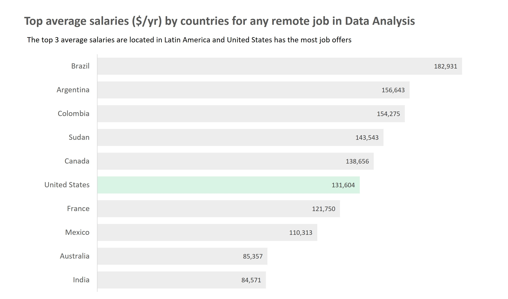

# Introduction
Dive into the data job market while figuring out what is the best way to land your first job as a Data Analyst. This project explores top-paying jobs, in-demand skills, and where high demand meets high salary in data analytics.

SQL queries? Check them out here: [sql_job_project folder](/sql_job_project/)

# Background
As a chemical engineer looking to turn to data analysis, I wanted to navigate the data analyst job market more effectively. This project was born from a desire to learn while highlighting top-paid and in-demand skills, streamlining my research to find optimal opportunities.

Luke Barousee offers a great opportunity to get both on his YouTube course, where he helps people like me achieve this goal by showcasing the skills we learned at the same that we can thoroughly understand the data analysis job market. 

Data hails from Luke's [SQL Course](https://lukebarousse.com/sql). It is packed with insights on job titles, salaries, locations, and essential skills.

### The questions I wanted to answer through my SQL queries were:

1. What are the top-paying remote jobs?
2. What are the top skills for any remote job in Data Analysis?
3. Where (Countries) are the top-paying jobs for any job in Data Analysis? What are their demand?
4. What are the most in-demand skills for a Data Analyst?
5. What are the top skills based on salary for a Data Analyst?
6. What are the most optimal skills to learn (High demand & high paying)?

# Tools I Used
- **SQL ->** The backbone of my analysis, allowing me to query the database and unearth critical insights.
- **PostgresSQL ->** The chosen database management system, ideal for handling the job post data.
- **Visual Studio Code ->** My go-to for database management and executing SQL queries.
- **Git & Github ->** Essential for version control and sharing my SQL script and analysis, ensuring collaboration and project tracking.

# The Analysis
Each query for this project aimed at investigating specific aspects of the data analyst job market. Here is how I approached each question:

### 1. What are the top-paying remote jobs?
To identify the highest-paying roles I filteres data analyst positions by average yearly salary and location, focusing on remote jobs. This query highlights the high paying opportunities in the field.

```sql 
SELECT
    job_title,
    name,
    job_country,
    salary_year_avg,
    job_via
FROM
    job_postings_fact 
    INNER JOIN company_dim ON job_postings_fact.company_id = company_dim.company_id
WHERE
    job_location = 'Anywhere' AND
    salary_year_avg IS NOT NULL
ORDER BY 
    salary_year_avg DESC
LIMIT 
    10;
```

Here is the breakdown of the top data analyst jobs in 2023:

- **Wide Salary Range:** Top 10 paying data analyst roles span from $184,000 to $650,000 indicating significant salary potential in the field.
- **Diverse employers:** Companies like SmartAsset, Meta, and AT&T are among those offering high salaries, showing a broad interest across different industries.
- **Wide Salary Range:** There is a high diversity in job title, from Data Analyst to Director of Analytics, reflecting varied roles and specializations within data analytics.


*This graph was built in Excel with the data results from my query*

### 2. What are the top skills for any remote job in Data Analysis?

```sql
-- CTE
WITH job_skills AS (
    SELECT 
        job_postings_fact.job_id,
        job_title,
        skills,
        salary_year_avg
    FROM
        job_postings_fact 
        INNER JOIN skills_job_dim ON job_postings_fact.job_id = skills_job_dim.job_id
        INNER JOIN skills_dim ON skills_job_dim.skill_id = skills_dim.skill_id
    WHERE
        salary_year_avg IS NOT NULL AND
        job_location = 'Anywhere'
    ORDER BY 
        salary_year_avg DESC
    )

--Query
SELECT
    skills,
    COUNT (skills) AS count_of_requested_skill,
    ROUND (AVG (salary_year_avg),0) AS avg_salary
FROM
    job_skills
GROUP BY 
    skills
ORDER BY 
    count_of_requested_skill DESC
LIMIT
     5;
```


*This graph was built in Excel with the data results from my query*

### 3. Where (Countries) are the top-paying jobs for any job in Data Analysis? What are their demand?

```sql
SELECT 
    job_country,
    COUNT (job_country) AS number_of_jobs,
    ROUND(AVG(salary_year_avg),0) AS average_salary
FROM
    job_postings_fact 
    INNER JOIN company_dim ON job_postings_fact.company_id = company_dim.company_id
WHERE
    salary_year_avg IS NOT NULL AND
    job_location = 'Anywhere' AND
    job_country IS NOT NULL
GROUP BY
    job_country
HAVING
    COUNT (job_country) > 4
ORDER BY
    average_salary DESC,
    number_of_jobs
LIMIT 10;
```

|Country       |Demand Count|  Avg. Salary ($)|
|--------------|------------|-----------------|
|Brazil	       |9	        |  182,931        |
|Argentina	   |7	        |  156,643        | 
|Colombia	   |10	        |  154,275        |
|Sudan	       |393	        |  143,543        |
|Canada	       |67	        |  138,656        |
|United States |2653	    |  131,604        |  
|France        |6	        |  121,750        |
|Mexico	       |8	        |  110,313        |
|Australia	   |7	        |  85,357         |
|India	       |7	        |  84,571         |


*This graph was built in Excel, it takes into account all roles for Data Analysts*

### 4. What are the most in-demand skills for a Data Analyst? 

```sql
SELECT
    skills,
    COUNT (skills) AS count_of_requested_skill
FROM
    job_postings_fact 
    INNER JOIN skills_job_dim ON job_postings_fact.job_id = skills_job_dim.job_id
    INNER JOIN skills_dim ON skills_job_dim.skill_id = skills_dim.skill_id
WHERE
    job_location = 'Anywhere' AND
    job_title LIKE '%Data Analyst%'
GROUP BY 
    skills
ORDER BY 
    count_of_requested_skill DESC
LIMIT
     5;
```


*This graph was built in Excel with the data results from my query*

### 5. What are the top skills based on salary for a Data Analyst?

```sql
SELECT
    skills,
    ROUND (AVG (salary_year_avg),0) AS avg_salary
FROM
    job_postings_fact 
    INNER JOIN skills_job_dim ON job_postings_fact.job_id = skills_job_dim.job_id
    INNER JOIN skills_dim ON skills_job_dim.skill_id = skills_dim.skill_id
WHERE
    salary_year_avg IS NOT NULL AND
    job_location = 'Anywhere' AND
    job_title LIKE '%Data Analyst%' 
GROUP BY 
    skills
ORDER BY 
    avg_salary DESC
LIMIT
     5;
```

*This graph was built in Excel with the data results from my query*

### 6. What are the most optimal skills to learn (High demand & high paying)?

```sql
SELECT
    skills,
    COUNT (skills) AS number_of_request,
    ROUND (AVG (salary_year_avg),0) AS avg_salary
FROM
    job_postings_fact 
    INNER JOIN skills_job_dim ON job_postings_fact.job_id = skills_job_dim.job_id
    INNER JOIN skills_dim ON skills_job_dim.skill_id = skills_dim.skill_id
WHERE
    salary_year_avg IS NOT NULL AND
    job_location = 'Anywhere' AND
    job_title LIKE '%Data Analyst%' 
GROUP BY 
    skills
ORDER BY 
    number_of_request DESC
LIMIT
     5;
```


*This graph was built in Excel with the data results from my query*

# What I Learned

Throughtout this adventure I have turbocharged my SQL toolkit with some rerious firepower:

-**Complex Query Crafting:** Mastered the art of advanced SQL, merging tables like a pro and wielding WITH clauses for ninja-level temp table maneuvers.
-**Data aggregation:** Got cozy with GROUP BY, COUNT, and COUNT into my data-summarizing sidekicks.
-**Analytical Wizardy:** Leveled up my real-world puzzel-solving skills, turning questions into actionable, insightful SQL queries.

# Conclusions

### Insights
From the analysis, several general insights emerged:

1. **Top-Paying Data Analyst Jobs:** The highest-paying jobs for data analysts that allow remote work offer a wide range of salaries, the highest at 650.000.
2. **Skills For Top-Paying Jobs:** High-paying Data Analyst jobs require advanced proficiency in SQL, suggesting it is a critical skill for earning a top salary.
3. **Most In-Demand Skills:** SQL is also the most demanded skill in the Data Analyst job market, thus making it essential for job seekers.
4. **Complex Query Crafting:** Specialized skills, such as SVN and Solidity, are associated with the highest average salaries, indicating a premium on niche expertise.
5. **Optimal Skills For Job Market Value:** SQL leads in-demand and offers for a high average salary positioning it as one of the most optimal skills for data analysts to learn to maximize their market value.

### Closing Thoughts

This project enhanced my SQL skills and provided insights into the data analysts job market. The findings from the analysis serve as a guide to prioritizing skill development and job search efforts. Aspiring sata analysts can better position themselves in a competitive job market by focusing on high-demand, high-salary skills. This exploration highlights the importance of continuous learning and adaptation to emerging trends in the field of data analytics. 
