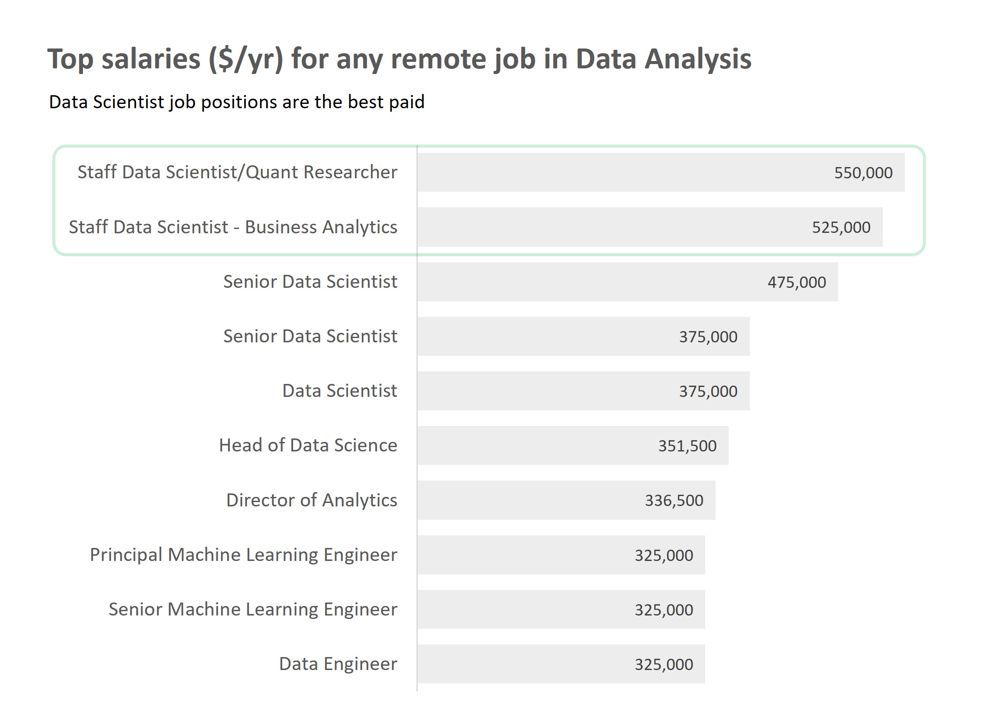
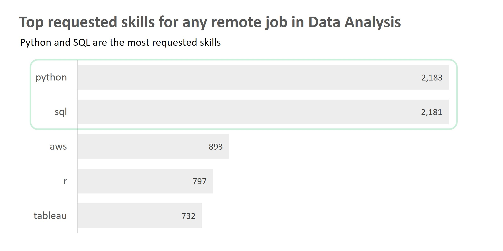
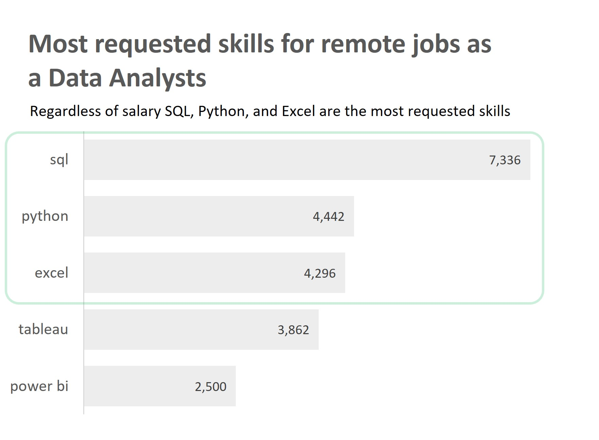
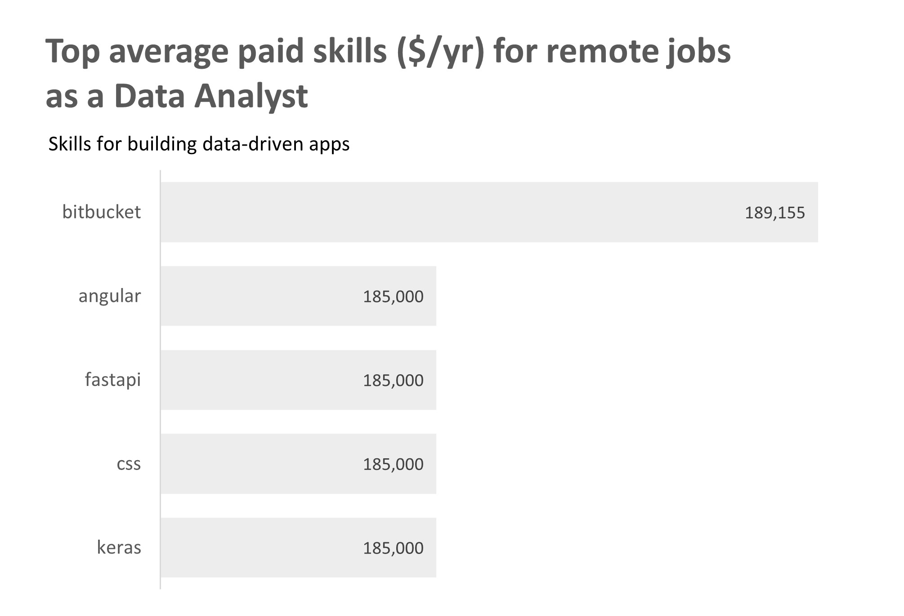
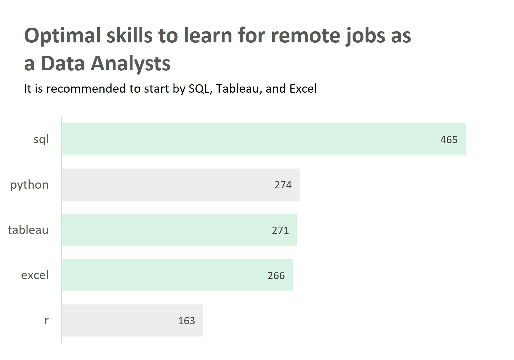

# 👉🏽Introduction
Dive into the data job market while figuring out what is the best way to land your first job as a Data Analyst. This project explores top-paying jobs, in-demand skills, and where high demand meets high salary in data analytics.

SQL queries? Check them out here: [sql_job_project folder](/sql_job_project/)

# ✨Background
As a chemical engineer looking to turn to data analysis, I wanted to navigate the data analyst job market more effectively. This project was born from a desire to learn while highlighting top-paid and in-demand skills, streamlining my research to find optimal opportunities.

Luke Barousee offers a great opportunity to get both on his YouTube course, where he helps people like me achieve this goal by showcasing the skills we learned at the same that we can thoroughly understand the data analysis job market. 

Data hails from Luke's [SQL Course](https://lukebarousse.com/sql). It is packed with insights on job titles, salaries, locations, and essential skills.

### The questions I wanted to answer through my SQL queries were:

1. What are the top-paying remote jobs in data analysis?
2. What are the top skills for any remote job in data analysis?
3. In which countries are the top-paying opportunities for any remote job in data analysis? What are their demand?
4. What are the most in-demand skills for a remote Data Analyst?
5. What are the top skills based on salary for a remote Data Analyst?
6. What are the most optimal skills to learn as a remote Data Analyst?

# 🔧Tools I Used
- **SQL ➡️** The backbone of my analysis, allowing me to query the database and get insights.
- **PostgresSQL ➡️** The chosen database management system, ideal for handling the job post data.
- **Visual Studio Code ➡️** My go-to for database management and executing SQL queries.
- **Microsoft EXCEL ➡️** My loyal visualization tool for small data sets.
- **Git & Github ➡️** Essential for version control and showcasing my SQL script and analysis.

# 📶The Analysis
Each query for this project aimed at investigating specific aspects of the data analyst job market. Here is how I approached each question:

### 1. What are the top-paying remote jobs?
To identify the highest-paying roles I filtered data analysis positions by average yearly salary and location, focusing on remote jobs. This query highlights the high-paying opportunities in the field, regardless of experience, where these job postings were made, and where I could apply for them.

```sql 
SELECT
    job_title,
    name,
    job_country,
    salary_year_avg,
    job_via
FROM
    job_postings_fact 
    INNER JOIN company_dim ON job_postings_fact.company_id = company_dim.company_id
WHERE
    job_location = 'Anywhere' AND
    salary_year_avg IS NOT NULL
ORDER BY 
    salary_year_avg DESC
LIMIT 
    10;
```

Here is the breakdown of the top data analyst jobs in 2023:

- **LinkedIn opportunities:** These job opportunities are in this platform, which enhances the importance of having a well-crafted LinkedIn profile.
- **Keep learning:** Top paying roles belong to Data Scientists and Data Engineers.
- **Diverse of roles:** There is a high diversity in job titles, from Data Analyst to Director of Analytics, reflecting varied roles and specializations within data analytics.
- **Diverse employers:** 8 out of 10 job postings are from the United States with companies like Selby Jennings, Algo Capital Group, Engtal, and Meta showing a broad interest across different industries.
- **Wide Salary Range:** Top 10 paying data analyst roles span from $325,000 to $550,000 indicating significant salary potential in the field.


*Graph built on Excel by Valeria Madera*

### 2. What are the top skills for any remote job in Data Analysis?
To identify the top skills for remote jobs I created a temporary table of job postings joined with the skills tables where skills would be related to job postings' requests. This query counts the number of job postings asking for each skill, providing insight into the top 5 most requested and their associated average salaries. 

```sql
-- CTE
WITH job_skills AS (
    SELECT 
        job_postings_fact.job_id,
        job_title,
        skills,
        salary_year_avg
    FROM
        job_postings_fact 
        INNER JOIN skills_job_dim ON job_postings_fact.job_id = skills_job_dim.job_id
        INNER JOIN skills_dim ON skills_job_dim.skill_id = skills_dim.skill_id
    WHERE
        salary_year_avg IS NOT NULL AND
        job_location = 'Anywhere'
    ORDER BY 
        salary_year_avg DESC
    )

--Query
SELECT
    skills,
    COUNT (skills) AS count_of_requested_skill,
    ROUND (AVG (salary_year_avg),0) AS avg_salary
FROM
    job_skills
GROUP BY 
    skills
ORDER BY 
    count_of_requested_skill DESC
LIMIT
     5;
```

Here is the breakdown of the top skills for jobs in 2023:

- **Python and SQL:** These skills were the most requested with around 2,180 requests, showing the importance of SQL.
- **Programming tools:** When your nich is this, better learn Python and then R since Python has three times more requests.
- **Cloud computing:** The third most in-demand and best-paid skill is AWS, a cloud computing service, which states the increasing use of cloud services and the opportunity behind it.
- **Visualization tools:** If you had to choose the most sought tool for this purpose, Tableau is probably the best option to start with. 


*Graph built on Excel by Valeria Madera*

### 3. In which countries are the top-paying opportunities for any remote job in data analysis? What are their demand?
To identify the top-paying countries for remote jobs in the field I filtered by country, where the count of offers was over 4, focusing on remote jobs, regardless of job position. This query highlights the high-paying countries, regardless of job position.

```sql
SELECT 
    job_country,
    COUNT (job_country) AS number_of_jobs,
    ROUND(AVG(salary_year_avg),0) AS average_salary
FROM
    job_postings_fact 
    INNER JOIN company_dim ON job_postings_fact.company_id = company_dim.company_id
WHERE
    salary_year_avg IS NOT NULL AND
    job_location = 'Anywhere' AND
    job_country IS NOT NULL
GROUP BY
    job_country
HAVING
    COUNT (job_country) > 4
ORDER BY
    average_salary DESC,
    number_of_jobs
LIMIT 10;
```
Here is the breakdown of the top skills for jobs in 2023:

- **Wide Salary Range:** The country's average salaries span from $84,500 to $182,900 indicating significant salary potential in the field.
- **Python and SQL:** These skills were the most requested with around 2,180 requests, showing the importance of SQL.
- **Programming tools:** Mastering Python and then R is the way to go. Python is three times more in-demand than R, making it a great starting point.
- **Cloud computing** The third most in-demand and best-paid skill is AWS, a cloud computing service, stating the increasing use of cloud services and the opportunity behind it.
- **Visualization tools:** If you had to choose the most sought tool for this purpose, Tableau is probably the best option to start with. 

|Country       |Demand Count|  Avg. Salary ($)|
|--------------|------------|-----------------|
|Brazil	       |9	        |  182,931        |
|Argentina	   |7	        |  156,643        | 
|Colombia	   |10	        |  154,275        |
|Sudan	       |393	        |  143,543        |
|Canada	       |67	        |  138,656        |
|United States |2653	    |  131,604        |  
|France        |6	        |  121,750        |
|Mexico	       |8	        |  110,313        |
|Australia	   |7	        |  85,357         |
|India	       |7	        |  84,571         |

*If you are looking for remote job opportunities, the United States is your best bet due to the number of proposals available. However, if you are fluent in Spanish, Argentina and Colombia offer great opportunities as well.*

### 4. What are the most in-demand skills for a remote Data Analyst?
To identify the top 5 in-demand skills for remote jobs I joined the job posting table with the skills tables, filtered by only Data Analyst roles, focusing on remote jobs. This query highlights the demand for each skill by counting out their requests.

```sql
SELECT
    skills,
    COUNT (skills) AS count_of_requested_skill
FROM
    job_postings_fact 
    INNER JOIN skills_job_dim ON job_postings_fact.job_id = skills_job_dim.job_id
    INNER JOIN skills_dim ON skills_job_dim.skill_id = skills_dim.skill_id
WHERE
    job_location = 'Anywhere' AND
    job_title LIKE '%Data Analyst%'
GROUP BY 
    skills
ORDER BY 
    count_of_requested_skill DESC
LIMIT
     5;
```

Here is the breakdown of the top 5 in-demand skills for Data Analysts in 2023:

- **Keep learning:** Mastering SQL, Python, Excel, Tableau, and Power BI will allow you to attain more chances of getting a job.
- **Variety of Tools:** The foundations are covered, a language to learn Python, a cleaning tool for big data use SQL, a visualization tool Tableau or Power BI, and if you want both for small data sets, Excel is your best bet.


*Graph built on Excel by Valeria Madera*

### 5. What are the top skills based on salary for a remote Data Analyst?
To identify the top-paying skills for remote jobs as a Data Analyst I filtered by Data Analyst roles, focusing on remote jobs, and ordered them from highest to lowest according to their average salary. This query highlights the top 5 best-paid skills and their associated salary.

```sql
SELECT
    skills,
    ROUND (AVG (salary_year_avg),0) AS avg_salary
FROM
    job_postings_fact 
    INNER JOIN skills_job_dim ON job_postings_fact.job_id = skills_job_dim.job_id
    INNER JOIN skills_dim ON skills_job_dim.skill_id = skills_dim.skill_id
WHERE
    salary_year_avg IS NOT NULL AND
    job_location = 'Anywhere' AND
    job_title LIKE '%Data Analyst%' 
GROUP BY 
    skills
ORDER BY 
    avg_salary DESC
LIMIT
     5;
```

Here is the breakdown of the top 5 best-paid skills for Data Analysts in 2023:

- **Great salary:** The salary for these skills spans from $185.000 to $189,100.
- **Niche skills:** Mastering skills in building data-driven applications can significantly boost your average salary.


*Graph built on Excel by Valeria Madera*

### 6. What are the most optimal skills to learn as a remote Data Analyst?
To identify the highest-demand and top-paying skills for remote jobs as a Data Analyst I filtered by Data Analyst roles, focusing on remote jobs, and ordered them from highest to lowest according to their count of requests. This query highlights the top 5 most wanted and best-paid skills, the number of requests, and their associated average salary.

```sql
SELECT
    skills,
    COUNT (skills) AS number_of_request,
    ROUND (AVG (salary_year_avg),0) AS avg_salary
FROM
    job_postings_fact 
    INNER JOIN skills_job_dim ON job_postings_fact.job_id = skills_job_dim.job_id
    INNER JOIN skills_dim ON skills_job_dim.skill_id = skills_dim.skill_id
WHERE
    salary_year_avg IS NOT NULL AND
    job_location = 'Anywhere' AND
    job_title LIKE '%Data Analyst%' 
GROUP BY 
    skills
ORDER BY 
    number_of_request DESC
LIMIT
     5;
```
Here is the breakdown of the top 5 optimal skills for Data Analysts in 2023:

- **Great salary:** The salary for these skills spans from $185.000 to $189,100.
- **Niche skills:** Mastering skills in building data-driven applications can significantly boost your average salary.
- 

*Graph built on Excel by Valeria Madera*

# ✏️What I Learned

Throughout this adventure I have powered my SQL toolkit with some:

- **Complex Query Crafting:** Mastered the art of advanced SQL, merging tables and using WITH clauses for table maneuvers.
- **Data aggregation:** Got cozy with GROUP BY, HAVING, COUNT (), and AVG () in my data-summarizing tricks book.
- **Analytical Super Power:** Leveled up my real-world problem-solving skills, turning questions into actionable, insightful SQL queries.

# 🏆Conclusions

### Insights
From the analysis, several general insights emerged:

1. **Top-Paying Data Analysis Jobs**
- The highest-paying jobs for data analysts that allow remote work offer a wide range of salaries, the highest at $550.000.
- The best opportunities for remote jobs are in the United States, offering a wide number of opportunities and a diversity of options.
  
2. **Skills For Top-Paying Jobs**
- High-paying Data Analyst jobs require advanced proficiency in Python and SQL, suggesting they are critical skills for earning a top salary.
- Niche skills associated with applications based on data are the best paid, however, they are not in great demand.
- Learning cloud computing as AWS could bring great benefits since it is in high demand and well paid.

4. **Most In-Demand Skills**
- The top skills recommended to start in this field are SQL, Excel, Tableau, or Power BI.
- Python and SQL are the most demanded skills in the data analysis job market, thus making them essential for job seekers.

5. **Optimal Skills For Job Market Value**
- SQL leads in-demand and offers a high average salary positioning it as one of the most optimal skills for data analysts to learn to maximize their market value, followed by Python, and Tableau.

### Closing Thoughts

This project enhanced my SQL skills and provided insights into the data analysis job market. The findings from the analysis serve as a guide to prioritizing skill development and job search efforts. This exploration highlights the importance of continuous learning, optimizing my learning path, and adapting to trends in the evolving field of data analytics. 
